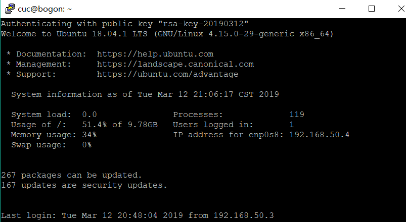

# chap0x01 VirtualBox 无人值守安装Unbuntu(18.04.1 server)系统实验
## 实验要求
- [x] 定制一个普通用户名和默认密码
- [x] 安装过程禁止自动联网更新软件包
- [x] 定制安装OpenSSH Server
- [x] PuTTy免密登陆
## 实验环境
* VirtualBox 
  * ubuntu 18.04.1 server
    * 网卡：NAT、Host-Only
    * 镜像：ubuntu-18.04.1-server-amd64.iso
* Windows10
  * PuTTy

## 实验过程
### 网络配置
* 添加并启用所有网卡，Host-Only网卡动态分配地址
```
# 查看所有网卡
ifconfig -a

# 启用第二块网卡
sudo ifconfig enp0s8 up
```
* 使用```netplan```配置网卡


```
# 修改配置文件
sudo vi /etc/netplan/01-netcfg.yaml

# 启用配置
sudo netplan apply

# 获取ip等信息 
sudo dhclient enp0s8
```


### 自动安装镜像定制
* 在server虚拟机上安装 openssh-server

```
# 更新源
sudo apt update

# 安装 OpenSSH 服务器应用
sudo apt install openssh-server

# 启用ssh
sudo /etc/init.d/ssh start
```


* 使用putty连接虚拟机


* 使用psftp将下载好的镜像传入虚拟机


* 根据实验指导进行定制镜像的制作
```
# 在当前用户目录下创建一个用于挂载iso镜像文件的目录
mkdir loopdir

# 挂载iso镜像文件到该目录
# -o loop 用来把一个文件当成硬盘分区挂接上系统
# loopdir 挂载点
sudo mount -o loop ubuntu-18.04.1-server-amd64.iso loopdir
# mount: /home/mosom/loopdir: WARNING: device write-protected, mounted read-only.

# 创建一个工作目录用于克隆光盘内容
mkdir cd
 
# 同步光盘内容到目标工作目录
# 一定要注意loopdir后的这个/，cd后面不能有/
# -a, --archive 归档模式，表示以递归方式传输文件，并保持所有文件属性
# -v, --verbose 详细模式输出
rsync -av loopdir/ cd

# 卸载iso镜像
sudo umount loopdir
```


```
# 进入目标工作目录
cd cd/

# 编辑Ubuntu安装引导界面增加一个新菜单项入口
# 修改配置以识别 ubuntu-server-autoinstall.seed
sudo vi isolinux/txt.cfg

# 在文件中添加以下内容
# 强制保存 `:w!`
# 一定置顶添加
label autoinstall
  menu label ^Auto Install Ubuntu Server
  kernel /install/vmlinuz
  append  file=/cdrom/preseed/ubuntu-server-autoinstall.seed debian-installer/locale=en_US console-setup/layoutcode=us keyboard-configuration/layoutcode=us console-setup/ask_detect=false localechooser/translation/warn-light=true localechooser/translation/warn-severe=true initrd=/install/initrd.gz root=/dev/ram rw quiet

```


```
# 修改配置缩短超时等待时间
# timeout 10
sudo vi isolinux/isolinux.cfg
```


* 下载已经定制好的ubuntu-server-autoinstall.seed

```
# 移动到指定目录下
sudo mv ubuntu-server-autoinstall.seed ~/cd/preseed/

# 重新生成md5sum.txt
find . -type f -print0 | xargs -0 md5sum > /tmp/md5sum.txt
sudo mv /tmp/md5sum.txt md5sum.txt
```


```
# 无 mkisofs 命令（提示安装genisoimage）
mkisofs --help

# 查找并安装相应的软件包
apt-cache search mkisofs
sudo apt install genisoimage

# 封闭改动后的目录到.iso
IMAGE=custom.iso
BUILD=~/cd/

mkisofs -r -V "Custom Ubuntu Install CD" \
            -cache-inodes \
            -J -l -b isolinux/isolinux.bin \
            -c isolinux/boot.cat -no-emul-boot \
            -boot-load-size 4 -boot-info-table \
            -o $IMAGE $BUILD
```
* 镜像制作完成，使用psftp传至宿主机
```
# 设置Windows本地路径
lcd E:/

# 传出
get custom.iso 
```


* 在VirtualBox上完成自动安装(动态图约10s)


* 安装完成


### PuTTy免密登陆
* 打开PUTTYGEN.EXE，点击```Generate```生成公私钥。


* 存储私钥，复制公钥
* 进入虚拟机，在根目录下创建```.ssh```文件夹，将刚刚生成的公钥写入该文件夹下的```authorized_keys```
```
# 创建目录
mkdir .ssh
cd .ssh

# 将刚才复制的公钥写入authorized_keys文件
echo 'public key' > authorized_keys
```


* 打开PuTTy.exe
* 'Connection'-->'Data',输入自动登录的用户名


* 'Connection'-->'SSH'-->'Auth',加载刚刚生成的私钥文件


* 'Session'输入虚拟机的IP地址，将此连接存储，下次可直接免密登陆


* 成功免密登陆



### 文件设置对比([对比工具](http://mergely.com/))
* 左侧为官方文档，右侧为定制文件


* 参考
  *  https://github.com/CUCCS/2015-linux-public-yangyisama/blob/master/Exp1/Exp1.md
  *  https://github.com/CUCCS/linux-2019-jckling/blob/b71eec1befc8df1d552db7e7008f05b4b1f9c539/0x01/README.md
  *  https://github.com/CUCCS/2015-linux-public-RachelLYY/blob/labs/lab1/%E6%97%A0%E4%BA%BA%E5%80%BC%E5%AE%88Linux%E5%AE%89%E8%A3%85%E9%95%9C%E5%83%8F%E5%88%B6%E4%BD%9C.md
  *  https://help.ubuntu.com/lts/installation-guide/example-preseed.txt