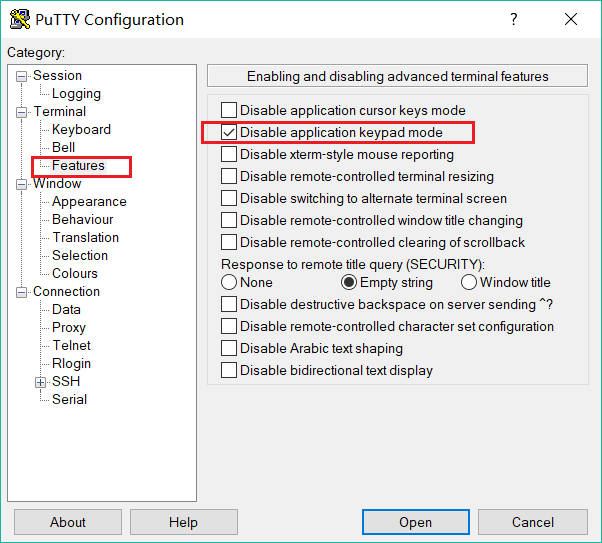

# chap0x02 From  GUI to CLI
## 实验环境
* VirtualBox 
  * ubuntu 18.04.1 server
    * 网卡：NAT、Host-Only
    * 镜像：ubuntu-18.04.1-server-amd64.iso
* Windows10
  * PuTTy

## asciinema
* [在线注册asciinema](https://asciinema.org/)
* 安装asciinema
```bash
# 更新
sudo apt-get update

# 安装asciinema
sudo apt install asciinema

# 将安装ID与已注册账户连接
asciinema auth
```
* 命令
```bash
# 开始录屏
asciinema rec

# 结束录屏
exit

# 上传到asciinema.org的账户上
<ENTER>

# 保存到本地
<ctrl-c>
```

## Vimtutor录屏
* [Lesson 1](https://asciinema.org/a/234451)
* [Lesson 2](https://asciinema.org/a/234455)
* [Lesson 3](https://asciinema.org/a/234458)
* [Lesson 4](https://asciinema.org/a/234462)
* [Lesson 5](https://asciinema.org/a/234466)
* [Lesson 6](https://asciinema.org/a/234594)
* [Lesson 7](https://asciinema.org/a/234597)

注：
* 在输入数字的时如果用小键盘会直接进入```INSERT```模式。查找资料后发现PuTTy中进行如下设置后可以正常使用小键盘。

 


## 自查清单
**1. 你了解vim有哪几种工作模式？**

* Normal 普通模式
* Command 命令模式
* Insert 插入模式
* Visual 可视模式

**2. Normal模式下，从当前行开始，一次向下移动光标10行的操作方法？如何快速移动到文件开始行和结束行？如何快速跳转到文件中的第N行？**

*  一次向下移动光标10行: ```10j```
*  移动到开始行： ```gg```
*  移动到结束行： ```G```
*  移动到第N行： ```Ngg```

**3. Normal模式下，如何删除单个字符、单个单词、从当前光标位置一直删除到行尾、单行、当前行开始向下数N行？**

* 单个字符： ```x```
* 单个单词： ```dw```
* 到行尾： ```d$```
* 单行： ```dd```
* 当前行开始向下数N行： ```dNd```

**4. 如何在vim中快速插入N个空行？如何在vim中快速输入80个-？**
* 快速插入N个空行：``` i Ctrl+O Ni<ENTER> <ESC>```
* 快速插入80个-： ```i Ctrl+O 80i- <ESC>```

**5. 如何撤销最近一次编辑操作？如何重做最近一次被撤销的操作？**

* 撤销：```u```
* 重做：```Ctrl+R```

**6. vim中如何实现剪切粘贴单个字符？单个单词？单行？如何实现相似的复制粘贴操作呢？**

* 剪切单个字符：```x```
* 剪切单个单词：```dw```
* 剪切单行：```d$```或```V```
* 任意部分：```v```移动光标选择
* 粘贴：```p```

**7. 为了编辑一段文本你能想到哪几种操作方式（按键序列）？**
* 打开/创建文本
  * ```vim <name>```
* 编辑
  * 插入
    * ```i```
    * ```o```或```O```
    * ```a```
  * 删除
    * ```x```
    * ```dw/d/$/```
    * ```Ndd```
  * 复制粘贴
    * ```v/V``` 
    * ```y```
    * ```p```
* 退出```<Esc>```
  * 保存
    * ```:wq!```
  * 不保存
    * ```:q!``` 

**8. 查看当前正在编辑的文件名的方法？查看当前光标所在行的行号的方法？**

*  均为```Ctrl+G```

**9. 在文件中进行关键词搜索你会哪些方法？如何设置忽略大小写的情况下进行匹配搜索？如何将匹配的搜索结果进行高亮显示？如何对匹配到的关键词进行批量替换？**
* 关键词x搜索： ```/x```
* 继续搜索： ```n```
* 反向搜索： ```?x```
* 忽略大小写的匹配搜索： ```:set ic```
* 将匹配的搜索结果进行高亮显示： ```:set hls```
* 对匹配到的关键词进行批量替换： ```%s/old/new/g```  


**10. 在文件中最近编辑过的位置来回快速跳转的方法？**

* 跳转到旧位置：```Ctrl+O```
* 跳转到新位置：```Ctrl+I```

**11. 如何把光标定位到各种括号的匹配项？例如：找到(, [, or {对应匹配的),], or }**

* 定位到待匹配的括号上点击： ```%```

**12. 在不退出vim的情况下执行一个外部程序的方法？**

* ```:!外部命令``` 如 ```!dir```

**13.如何使用vim的内置帮助系统来查询一个内置默认快捷键的使用方法？如何在两个不同的分屏窗口中移动光标？**
* ```:help欲查询项的默认快捷键``` 如```:help w```
* 在两个不同的分屏窗口中移动光标： ```Ctrl+W```


<br>
<br>
<br>

* [Vim在线手册](http://vimdoc.sourceforge.net/htmldoc/usr_toc.html)