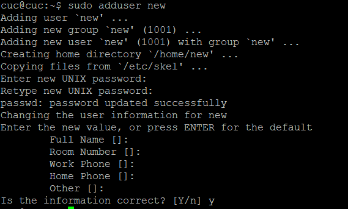
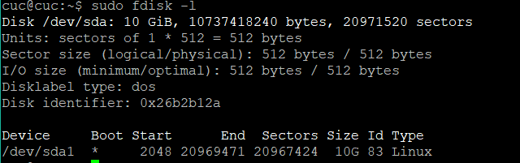
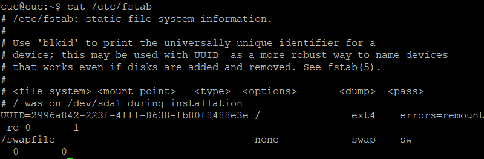
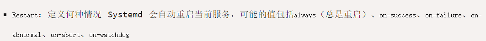

# chap0x03 Systemd入门
## 实验环境
* VirtualBox 
  * ubuntu 18.04.1 server
    * 网卡：NAT、Host-Only
    * 镜像：ubuntu-18.04.1-server-amd64.iso
* Windows10
  * PuTTy


## Systemd命令行
[Systemd 入门教程：命令篇](http://www.ruanyifeng.com/blog/2016/03/systemd-tutorial-commands.html)
* [操作录屏](https://asciinema.org/a/236478)

[Systemd 入门教程：实战篇](http://www.ruanyifeng.com/blog/2016/03/systemd-tutorial-part-two.html)
* [操作录屏](https://asciinema.org/a/236657)

## 自查清单
**1. 如何添加一个用户并使其具备sudo执行程序的权限？**
 
```bash
# 添加一个new用户
sudo adduser new

# 将new用户加入sudo组内
sudo adduser new sudo
```


**2. 如何将一个用户添加到一个用户组？**
```bash
# 将new用户加入用户组内
sudo adduser new 组名
```

**3. 如何查看当前系统的分区表和文件系统详细信息？**
```bash
# 查看当前系统分区表
sudo fdisk -l
```


```bash
# 查看文件系统详细信息
cat /etc/fstab
```


**4. 如何实现开机自动挂载Virtualbox的共享目录分区？**
* 使用VirtualBox的```共享文件夹```

```bash
# 手动配置
# 新建挂载目录
mkdir ~/shared

# 挂载文件夹
sudo mount -t vboxsf codes ~/shared

# 修改配置文件
sudo gedit /etc/fstab

# 修改模块
sudo gedit /etc/modules
```

**5. 基于LVM（逻辑分卷管理）的分区如何实现动态扩容和缩减容量？**
```bash
# 查看逻辑卷信息
lvdisplay

# 缩容2G
lvreduce --size -2g /dev/bogon-vg/root

# 扩容2G
lvextend --size +2g /dev/bogon-vg/root

# 更改大小
lvresize --size +2g /dev/bogon-vg/root

```


**6. 如何通过systemd设置实现在网络连通时运行一个指定脚本，在网络断开时运行另一个脚本？**

* 修改```NetworkManager.service```配置文件的Service区块
```
# 连通时运行此脚本
ExecStartPost = x.service

# 断开时运行此脚本
ExecStopPost = y.service
```

**7. 如何通过systemd设置实现一个脚本在任何情况下被杀死之后会立即重新启动？实现杀不死？**

* 对于Service类型的脚本修改```[Service]```区块中的```Restart```字段



* 参考
  *  [同学作业](https://github.com/CUCCS/linux-2019-jckling/blob/02cda23fbddc44db254fe78b4de53a6dbe6e2f5e/0x03/%E5%AE%9E%E9%AA%8C%E6%8A%A5%E5%91%8A.md)