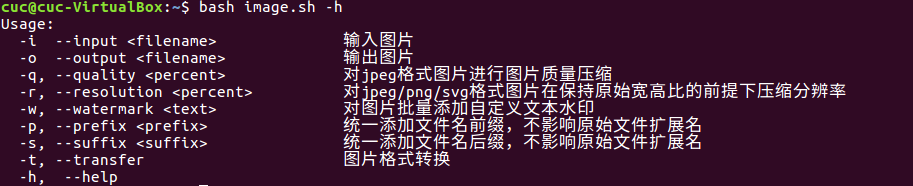
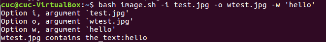
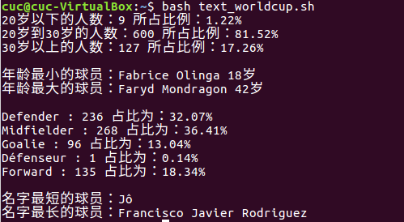
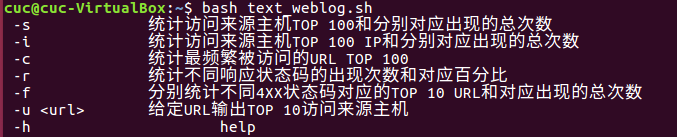
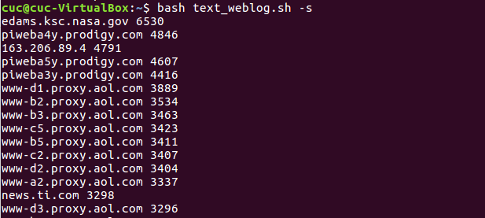
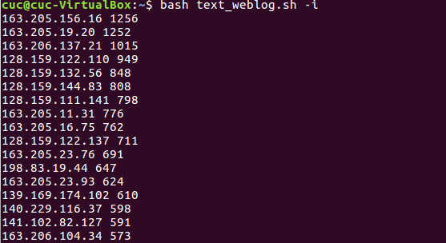
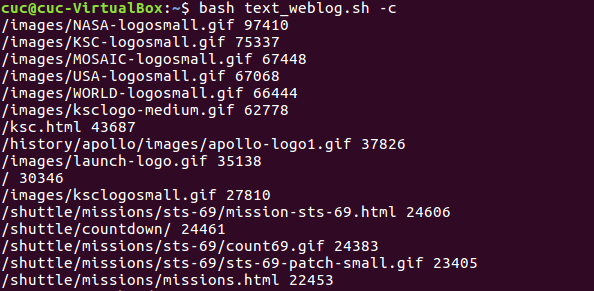
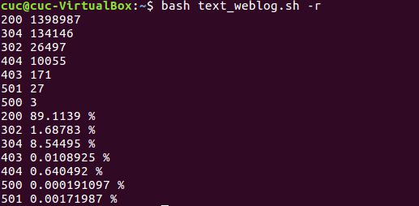
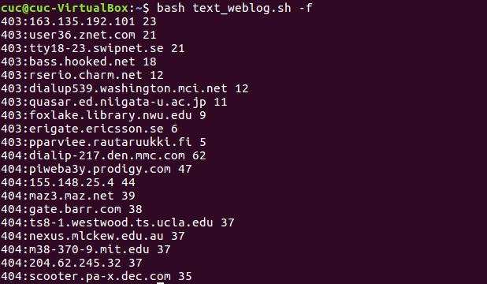
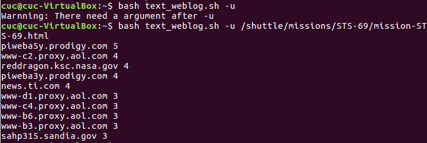

# chap0x04  SHELL脚本编程基础
## 任务一
* 用bash编写一个图片批处理脚本，实现以下功能：
* 支持命令行参数方式使用不同功能
* 支持对指定目录下所有支持格式的图片文件进行批处理
* 支持以下常见图片批处理功能的单独使用或组合使用
  * 支持对jpeg格式图片进行图片质量压缩
  * 支持对jpeg/png/svg格式图片在保持原始宽高比的前提下压缩分辨率
  * 支持对图片批量添加自定义文本水印
  * 支持批量重命名（统一添加文件名前缀或后缀，不影响原始文件扩展名）
  * 支持将png/svg图片统一转换为jpg格式图片

* 程序帮助信息如下



* 实验结果
```bash
# 对jpeg格式图片进行图片质量压缩
bash image.sh -i test.jpg -o output.jpg -q [size]

# 对jpeg/png/svg格式图片在保持原始宽高比的前提下压缩分辨率
bash image.sh -i test.jpg -o output.jpg -r [size]

# 对图片批量添加自定义文本水印
bash image.sh -i test.jpg -o output.jpg -w 'text'
```



```bash
# 批量重命名（统一添加文件名前缀或后缀，不影响原始文件扩展名）
支持将png/svg图片统一转换为jpg格式图片
# 加前缀
bash image.sh -i test.jpg -o output.jpg -p test
# 加后缀
bash image.sh -i test.jpg -o output.jpg -s jpg
  
```


```bash
# 支持将png/svg图片统一转换为jpg格式图片
bash image.sh -t -i test.svg -o output.jpg
```

## 任务二（1）
* 用bash编写一个文本批处理脚本，对以下附件分别进行批量处理完成* * 相应的数据统计任务：
  * 统计不同年龄区间范围（20岁以下、[20-30]、30岁以上）的球员数量、百分比
  * 统计不同场上位置的球员数量、百分比
  * 名字最长的球员是谁？名字最短的球员是谁？
  * 年龄最大的球员是谁？年龄最小的球员是谁？
 
* 实验结果



## 任务二（2）
* 用bash编写一个文本批处理脚本，对以下附件分别进行批量处理完成相应的数据统计任务：
  * 统计访问来源主机TOP 100和分别对应出现的总次数
  * 统计访问来源主机TOP 100 IP和分别对应出现的总次数
  * 统计最频繁被访问的URL TOP 100
  * 统计不同响应状态码的出现次数和对应百分比
  * 分别统计不同4XX状态码对应的TOP 10 URL和对应出现的总次数
  * 给定URL输出TOP 100访问来源主机

* 程序帮助信息如下



* 实验结果
```bash
# 统计访问来源主机TOP 100和分别对应出现的总次数
bash text_weblog.sh -s
```
   

```bash
# 统计访问来源主机TOP 100  IP和分别对应出现的总次数
bash text_weblog.sh -i
```
   

```bash
# 统计最频繁被访问的URL TOP 100
bash text_weblog.sh -c
```
   

```bash
# 统计不同响应状态码的出现次数和对应百分比
bash text_weblog.sh -r
```
   

```bash
# 分别统计不同4XX状态码对应的TOP 10 URL和对应出现的总次数
bash text_weblog.sh -f
```
   

```bash
# 给定URL输出TOP 100访问来源主机
bash text_weblog.sh -u <url>
```
   

* 参考
  * https://github.com/CUCCS/linux/tree/master/2017-1/cay 
  * https://github.com/CUCCS/linux/tree/master/2017-1/FitzBC/%E5%AE%9E%E9%AA%8C4
  * https://github.com/CUCCS/linux/tree/master/2017-1/ZZJ/Exe04