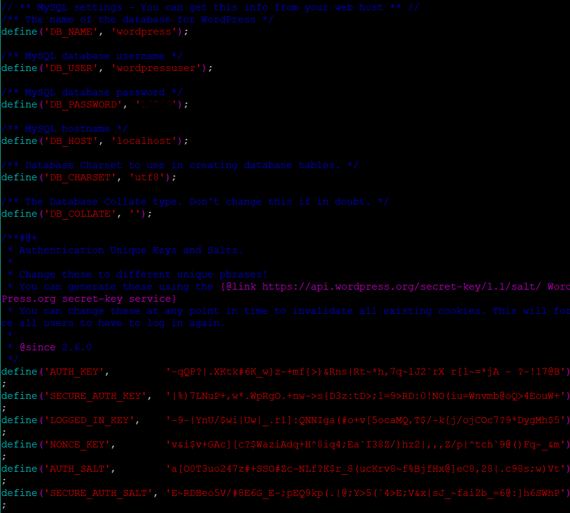
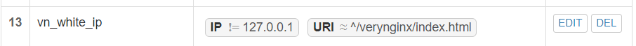
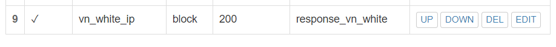

# chap0x05 WEB服务器
## 实验环境
#### 虚拟机
Ubuntu 18.04 Server
* NAT
* Host-Only: 192.168.50.4
#### 主机
* Win10
#### 网站
Nginx 
* wp.sec.cuc.edu.cn
  * 8080
* dvwa.sec.cuc.edu.cn
  * 8090
VeryNginx
* vn.sec.cuc.edu.cn
  * 8080 
  * 443

## 实验过程
### 环境配置
#### 域名解析
在主机的```C:\Windows\System32\drivers\etc\hosts```文件添加
```bash
192.168.50.4 vn.sec.cuc.edu.cn
192.168.50.4 dvwa.sec.cuc.edu.cn
192.168.50.4 wp.sec.cuc.edu.cn
```

#### Nginx 1.14.0
* 直接安装，默认监听80端口，稍后修改配置文件
```bash
# 安装nginx
sudo apt-get update
sudo apt install nginx
# 扩展
sudo apt-get install mysql-server
sudo apt-get install php-fpm
sudo apt-get install php-mysql
sudo apt-get install php-gd
sudo apt install php-curl php-gd php-intl php-mbstring php-soap php-xml php-xmlrpc php-zip

 # 启动nginx 
 sudo systemctl start nginx
```
* 配置nginx使用php
```bash
# 修改nginx配置PHP-FPM进程的反向代理配置在nginx服务器上 保存退出
sudo vim /etc/nginx/sites-enabled/default

     location ~ \.php$ {
         include snippets/fastcgi-php.conf;
          fastcgi_pass unix:/var/run/php/php7.2-fpm.sock;
     }
     
 # 重新启动nginx使配置生效
 sudo systemctl restart nginx

```

#### VeryNginx
* 安装 VeryNginx&OpenResty
```bash
# 按提示安装git
git clone https://github.com/alexazhou/VeryNginx.git
cd VeryNginx
# 可能需要提权
# 不需要Python组件支持(脚本为简单的复制和授权)
python install.py install verynginx
```
* 安装依赖项
```bash
# 安装后再次执行python install.py install verynginx
sudo apt-get install libpcre3-dev
sudo apt-get install libssl-dev
sudo apt-get install build-essential

# 出现有关于安装zlib的报错则执行
sudo apt install zlib
sudo apt install zlib1g
sudo apt install zlib1g-dev
# 只有出现‘ *** All work finished successfully, enjoy it~ ’才安装成功
```
* 按[教程](https://www.digitalocean.com/community/tutorials/how-to-create-an-ssl-certificate-on-nginx-for-ubuntu-14-04)配置文件开启ssl，并且生成ssl key和证书文件
```bash
# 签发证书
sudo openssl req -x509 -nodes -days 365 -newkey rsa:2048 -keyout /etc/ssl/private/nginx-selfsigned.key -out /etc/ssl/certs/nginx-selfsigned.crt
# 按提示输入信息

# 配置证书
# 创建配置文件
sudo vi /etc/nginx/snippets/self-signed.conf
# 写入以下内容
ssl_certificate /etc/ssl/certs/nginx-selfsigned.crt;
ssl_certificate_key /etc/ssl/private/nginx-selfsigned.key;
# 保存退出

# 修改Nginx配置
sudo vi /etc/nginx/sites-available/default
# 测试
sudo nginx -t
# 测试无误后重启Nginx
sudo systemctl restart nginx
```

* [配置VeryNginx](https://www.mfeng.cc/archives/2017/04/22/verynginx_install.html)，在```/opt/verynginx/openresty/nginx/conf/nginx.conf``` 中将```user```值改为```www-data```，```server```监听端口改为8080
```bash
sudo vim /opt/verynginx/openresty/nginx/conf/nginx.conf
# 将user从nginx修改为www-data
# 修改server监听端口为8080

```

* 配置完成后，运行Nginx
```bash
# 创建用户
sudo adduser verynginx

# 不能直接启动nginx
sudo /opt/verynginx/openresty/nginx/sbin/nginx
```
* 安装完成


#### Wordpress 4.7
* 下载并安装
```bash
# 下载安装包
sudo wget https://wordpress.org/wordpress-4.7.zip

# 解压安装包
unzip wordpress-4.7.zip

# 将解压后的wordpress移到指定路径
sudo mkdir /var/www/html/wp.sec.cuc.edu.cn
sudo cp wordpress /var/www/html/wp.sec.cuc.edu.cn
```
* 在Mysql中新建一个数据库用于支撑Wordpress
```bash
# 前面已安装mysql
# 新建一个数据库wordpress
CREATE DATABASE wordpress DEFAULT CHARACTER SET utf8 COLLATE utf8_unicode_ci;

# 新建一个用户 刷新并退出
GRANT ALL ON wordpress.* TO 'wordpressuser'@'localhost' IDENTIFIED BY 'password';
FLUSH PRIVILEGES;
EXIT;

# 修改nginx配置 
sudo vim /etc/nginx/sites-enabled/default

# 将网站根站点修改为wordpress的安装目录 并保存退出
root /var/www/html/wp.sec.cuc.edu.cn;

# 从WordPress密钥生成器中获取安全值
curl -s https://api.wordpress.org/secret-key/1.1/salt/
```
* 将生成的内容复制到```/var/www/html/wp-config.php```中，并修改数据库的设置，如下图



* 安装完成


#### DVWA 1.10
* 直接下载配置
```bash
# 下载DVWA
sudo git clone https://github.com/ethicalhack3r/DVWA /tmp/DVWA
# 移动到指定文件夹中
sudo mv /tmp/DVWA /var/www/html
# /config/config.inc.php.dist 去掉.dist
sudo cp /var/www/html/DVWA/config/config.inc.php.dist /var/www/html/DVWA/config/config.inc.php

```
* 在mysql为DVWA新建一个用户名, 修改DVWA中的配置,用于连接mysql数据库
```bash 
# 登录MySQL
sudo mysql -u root -p

# 新建一个数据库dvwa
 CREATE DATABASE dvwa DEFAULT CHARACTER SET utf8 COLLATE utf8_unicode_ci;

# 新建一个用户dvwauser，分配管理dvwa的权限，设置密码 刷新并退出
 GRANT ALL ON dvwa.* TO 'dvwauser'@'localhost' IDENTIFIED BY 'p@ssw0rd';
 FLUSH PRIVILEGES;
 EXIT;
# 重启mysql生效
sudo systemctl restart mysql
 
# 打开DVWA的配置文件
 sudo vim /var/www/html/DVWA/config/config.inc.php
 
# 修改配置文件为自己需要的内容 保存退出
 $_DVWA[ 'db_server' ]   = '127.0.0.1';
 $_DVWA[ 'db_database' ] = 'dvwa';
 $_DVWA[ 'db_user' ]     = 'dvwauser';
 $_DVWA[ 'db_password' ] = 'p@ssw0rd';

# 修改php配置
sudo vi /etc/php/7.2/fpm/php.ini    
# allow_url_include = Off -> On

# 设置文件夹权限 
sudo chown -R www-data.www-data /var/www/html/DVWA

# 重启php
sudo systemctl restart php7.2-fpm

# 配置Nginx，开启8090端口监听
sudo vi /etc/nginx/sites-available/default

# 重启Nginx
sudo systemctl restart nginx
# /etc/nginx/sites-available/default详见配置文件
```
* 最终配置[/etc/nginx/sites-available/default](conf/default)
* 安装完成，登录用户名密码分别为：admin和password，进入主界面


### 实验要求 
#### 反向代理
在VeryNginx中配置如下：
* Matcher

* Proxy Pass


#### 安全加固要求
##### 使用IP地址方式均无法访问上述任意站点，并向访客展示自定义的友好错误提示信息页面-1
* Matcher


* Response


* Filter


* 结果


##### DVWA只允许白名单上的访客来源IP，其他来源的IP访问均向访客展示自定义的友好错误提示信息页面-2

* Matcher


* Response


* Filter


* 结果


##### 在不升级Wordpress版本的情况下，通过定制VeryNginx的访问控制策略规则，热修复WordPress < 4.7.1 - Username Enumeratio（漏洞复现失败）
* Matcher


* Response


* Filter


##### 通过配置VeryNginx的Filter规则实现对Damn Vulnerable Web Application (DVWA)的SQL注入实验在低安全等级条件下进行防护
* Matcher


* Response


#### VeryNginx配置要求
##### VeryNginx的Web管理页面仅允许白名单上的访客来源IP，其他来源的IP访问均向访客展示自定义的友好错误提示信息页面-3
* Matcher



* Response


* Filter



* 结果


##### 限制DVWA站点的单IP访问速率为每秒请求数 < 50，限制Wordpress站点的单IP访问速率为每秒请求数 < 20，超过访问频率限制的请求直接返回自定义错误提示信息页面-4
* Matcher


* Response


* Filter


 
##### 禁止curl访问
* Matcher


* Response


* Filter


## 总结
* 在安装Nginx时先选择了手动配置，走了不少弯路。
* 配置Nginx时出现```systemd[1]: Failed to start A
high performance web server and a reverse proxy server.```的问题是由于证书文件配置时出了问题
* 配置文件中的版本号和使用的要统一
* 踩了很多坑，做此类实验需要耐心(和细心)！！！
* 有部分配置还没有完全实现，还在排错中

## 参考链接
* [配置ssl](https://www.digitalocean.com/community/tutorials/how-to-create-an-ssl-certificate-on-nginx-for-ubuntu-14-04)
* [安装VeryNginx](https://www.mfeng.cc/archives/2017/04/22/verynginx_install.html)
* [往届作业1](https://github.com/CUCCS/linux/blob/master/2017-1/FitzBC/%E5%AE%9E%E9%AA%8C5/%E5%AE%9E%E9%AA%8C%E6%8A%A5%E5%91%8A5_20170329.md)
* [往届作业2](https://github.com/CUCCS/linux/blob/master/2017-1/TJY/webserver/webserver.md)
* [同学作业1](https://github.com/CUCCS/linux-2019-jackcily/blob/0f02a3511cb15364e7f9837f16b6f74eb4389c61/job5/%E5%AE%9E%E9%AA%8C5.md)
* [同学作业2](https://github.com/CUCCS/linux-2019-jckling/blob/7ec398f09bfe2a6d79eb4f928ba7deae09b8c170/0x05/%E5%AE%9E%E9%AA%8C%E6%8A%A5%E5%91%8A.md)
* [同学作业3](https://github.com/CUCCS/linux-2019-Cassie8888/blob/fd23620a0033511464aaa375b85fb51d412ea140/linux05/%E5%AE%9E%E9%AA%8C%E4%BA%94.md)